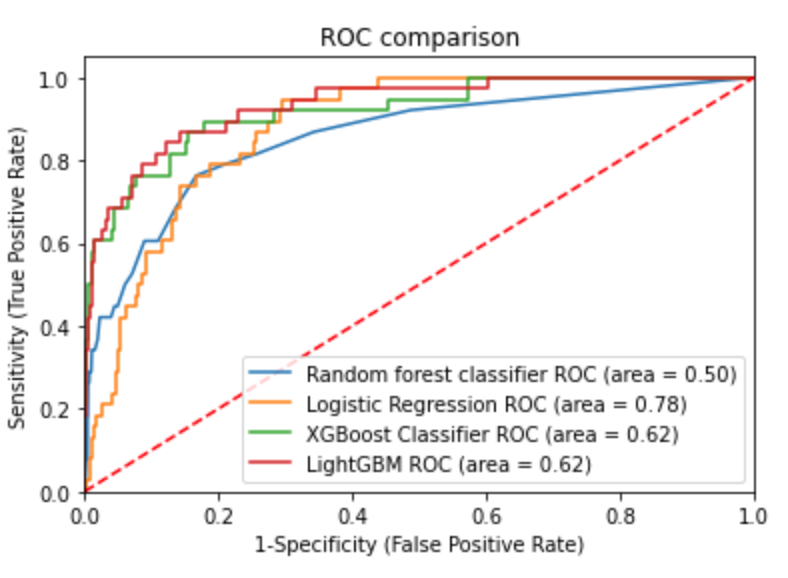

# Credit_model

[View portfolio](https://reejungkim.github.io/)

[View code: Scorecard](https://nbviewer.jupyter.org/github/reejungkim/Credit_model/blob/main/scorecard.ipynb)

[View code: bankruptcy prediction](https://nbviewer.jupyter.org/github/reejungkim/Credit_model/blob/main/Predicting%20bankruptcies.ipynb)
- classifier models applied: random forest, logitics, xgboost, lightGBM 
- metrics for model evaluation: ROC curve
- metrics for feature importance: Shapley values
 
