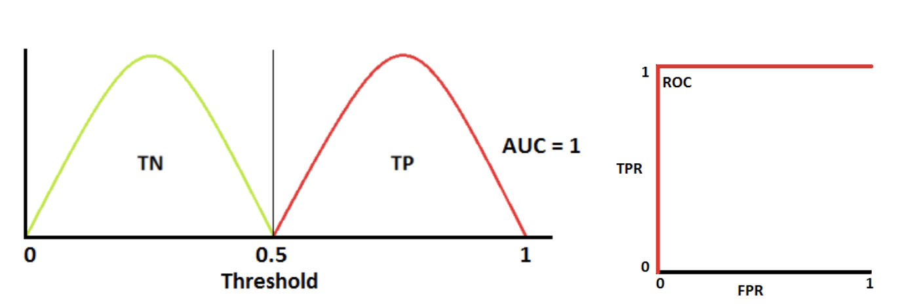

# Credit model

 
 

  

Credit Risk = PD * EAD * LGD
(Credit Risk = Probability of default * Exposure at default * Loss given default)

[View code: Population Stability Index (PSI) calculation](https://github.com/reejungkim/Credit_model/blob/main/PSI%20calculation.ipynb)
  - Criteria: PSI < .25
  
[View code: Kolmogorov-Smirnov (KS) calculation](https://github.com/reejungkim/Credit_model/blob/main/K-S%20calculation.ipynb)
  - Criteria: KS > 30%
  
   

[View code: Information Value (IV) calculation](https://github.com/reejungkim/Credit_model/blob/main/IF%20calculation.ipynb)
    
[View code: Scorecard](https://github.com/reejungkim/Scorecard/blob/main/Scorecard%20binning.ipynb)

## Bankruptcy prediction
[View code: bankruptcy prediction](https://nbviewer.jupyter.org/github/reejungkim/Credit_model/blob/main/Predicting%20bankruptcies.ipynb)
- feature reduction: recursive feature selection with cross validation (RFECV)
- classifier models applied: random forest, gradientboost, xgboost, lightGBM
- hyperparameter optimization: RandomSearchCV, GridSearch 
- metrics for model evaluation: confusion matrix, ROC-AUC, accuracy, precision, recall, f1-score, support
- metrics for feature importance: feature importance, Shapley values, Morris sensitivity
 

#### ROC explanation

   

#### Binary claissifier evaluation metrics explanation:

 
  (trade-off between Precision and Recall)

#### Model explainer

   

## References 
- [sklearn GridSearchCV](https://scikit-learn.org/stable/modules/generated/sklearn.model_selection.GridSearchCV.html)
- [Towards Data Science model tuning](https://towardsdatascience.com/streamline-model-tuning-on-bankruptcy-predictions-aabbc2fe62c0)
- [RFECV](https://process-mining.tistory.com/138)
- [XGBoost 파라미터 튜닝](https://zzinnam.tistory.com/entry/XGBoost-%ED%8C%8C%EB%9D%BC%EB%AF%B8%ED%84%B0-%EC%A1%B0%EC%A0%95%ED%8A%9C%EB%8B%9D)
- [소매금융 신용평가 및 스코어링모형의 적합성 검증 PPT](https://slidesplayer.org/slide/17900551/https://slidesplayer.org/slide/17900551/)
- [2021 가명정보 활용 우수사례 대상 카카오뱅크 유튜브](https://www.youtube.com/watch?v=Ieqvp8n5PnE&ab_channel=K-ICT%EB%B9%85%EB%8D%B0%EC%9D%B4%ED%84%B0%EC%84%BC%ED%84%B0)
- [카뱅 신용평가모델 삼프로 유튜브](https://www.youtube.com/watch?v=XwMwmpyNsdA&ab_channel=%EC%82%BC%ED%94%84%EB%A1%9CTV_%EA%B2%BD%EC%A0%9C%EC%9D%98%EC%8B%A0%EA%B3%BC%ED%95%A8%EA%BB%98)

